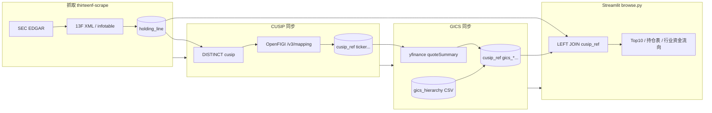

# 开发原理：CUSIP · OpenFIGI · yfinance · GICS

本文说明本仓库里**证券标识从哪来、如何入库、如何匹配**，以及三者在链路中的分工。面向维护 `thirteenf-sync-cusip-refs`、`thirteenf-sync-gics-sectors` 与 Streamlit 界面的开发。

用户操作命令见根目录 [README.md](../README.md) 的「增量 · 证券主数据」小节。

---

## 1. 总览：三条链路

13F 分析的数据流分成 **抓取（SEC）** 与 **主数据 enrichment（外部 API + 本地表）** 两段：



| 概念 | 在本项目中的角色 |
|------|------------------|
| **CUSIP** | 从 13F 申报 XML **解析得到**，存在 `holding_line.cusip`；是后续一切映射的**主键** |
| **OpenFIGI** | 把 CUSIP **离线批量**换成 Ticker、名称、FIGI 等，写入 `cusip_ref` |
| **yfinance** | 用 **Ticker** 向 Yahoo 拉 `sector` / `industry`，再归并到 **GICS** |
| **GICS** | 官方行业分类；L1–L4 中 L1 来自 Yahoo→映射表，L2–L4 来自本地层级 CSV 与 Yahoo industry 的**模糊匹配** |

**重要**：OpenFIGI **不抓 13F**；yfinance **不解析 CUSIP**。二者都依赖你先跑 `thirteenf-scrape` 把持仓写入 SQLite。

---

## 2. CUSIP 是什么？本项目如何获得？

### 2.1 定义

**CUSIP**（Committee on Uniform Securities Identification Procedures）是北美证券常用的 **9 位标识**（本库统一 `UPPER(TRIM(...))` 存表）。  
13F-HR 的 `informationTable` 每一行通常带 `cusip`、`nameOfIssuer`、`titleOfClass`、`value`、`shrsOrPrnAmt` 等。

境外/以色列等标的在申报里可能出现 **CINS 形态**（字母开头的 9 位，如 `M25722105`），在 OpenFIGI 里有时要用 **`ID_CINS`** 才能映射到 Ticker，而不是 `ID_CUSIP`。

### 2.2 抓取方式（唯一来源：SEC）

| 步骤 | 模块 | 行为 |
|------|------|------|
| 列表 | `thirteenf/scrape/edgar.py` | `data.sec.gov/submissions/CIK{cik}.json` → `iter_13f_filings()` |
| 下载 | 同上 | `primary_doc.xml` 或 `index.json` 找到的 `infotable.xml` |
| 解析 | `edgar.parse_information_table_xml()` | 抽出 `cusip`、发行人、市值等 |
| 入库 | `thirteenf/scrape/runner.py` | `holding_line` 按 `(ingest_id, line_no)` 写入 |

**CUSIP 没有单独对外「抓取服务」**；不会向 CUSIP Global 之类机构实时查询。新 CUSIP 只会在**新 13F 入库**后出现。

相关表：

- `ingest_record`：一次报送元数据（机构 CIK、`report_date`、`status=complete` 等）
- `holding_line`：该报送下的持仓行，**`cusip` 字段为原始申报值**

---

## 3. OpenFIGI 是什么？如何匹配 Ticker？

### 3.1 定义

[OpenFIGI](https://www.openfigi.com/) 是 Bloomberg 维护的 **开放映射 API**，把多种 ID（CUSIP、ISIN、Ticker、FIGI…）对应到 **FIGI** 及 **ticker、name、exchCode、securityType** 等元数据。

本项目只用 **`POST https://api.openfigi.com/v3/mapping`**，批量把 **CUSIP → 美股/ADR 常用 Ticker**。

### 3.2 触发方式（CLI）

| 命令入口 | 实现 |
|----------|------|
| `uv run thirteenf-sync-cusip-refs` | `thirteenf/cusip_ref.py` → `cli_main()` |
| `uv run python -m thirteenf.cusip_ref` | 同上 |

**待同步 CUSIP 集合**来自 `holding_line` 的 `DISTINCT cusip`（不是来自 OpenFIGI 反查全市场）：

| 模式 | 参数 | SQL 语义 |
|------|------|----------|
| 默认 | （无） | 仅 `cusip_ref` 中**尚无行**的 CUSIP |
| 日常推荐 | `--refresh-gaps` | 无行 **或** ticker 空 **或** `error_note` 非空 |
| 全量重刷 | `--force-all` | 所有 DISTINCT cusip，覆盖已有 ticker |

实现：`collect_cusips_for_sync()` → `sync_cusip_refs_from_holdings()`。

### 3.3 匹配算法（核心）

对每个批次（默认最多 10 条/请求；有 `OPENFIGI_API_KEY` 时最多 100）：

1. **`ID_CUSIP`**：对每个 CUSIP 发一条 mapping job。  
2. **回退 `ID_CINS`**：若该 CUSIP 在 CUSIP 类型下无 `data`，对**同一字符串**再试 `ID_CINS`（` _openfigi_map_cusips_with_fallback()`）。  
3. **候选打分**：若返回多条，用 `_pick_best_mapping()` 选一条：  
   - 加分：`marketSector == equity`、Common Stock、交易所 `UN/UW/UA…`  
   - 减分：债、优先股、带 `%` 的债性描述等  
4. **写入 `cusip_ref`**：  
   - 成功：`ticker`（大写）、`name`、`exch_code`、`security_type`、`figi`、`source=openfigi_v2`  
   - 失败：`error_note=not_found`，ticker 置空  

限流：无 Key 时约 10 job/请求；429 时指数退避重试。环境变量：`OPENFIGI_API_KEY`、`OPENFIGI_USER_AGENT`（或复用 `.env` 里习惯写法）。

### 3.4 与界面的关系

`thirteenf/gui/browse.py` 中 `_merge_tickers_from_ref()`：

- 按当前表里的 CUSIP 列表 `SELECT cusip, ticker FROM cusip_ref WHERE cusip IN (...)`  
- 无 ticker 时展示 `(CUSIP)`，避免 pandas `NaN` 显示成 `NAN`  

持仓明细 SQL 直接 `LEFT JOIN cusip_ref ON r.cusip = TRIM(h.cusip)`。

### 3.5 已知局限

- OpenFIGI **不提供 GICS**；行业必须走下一节 yfinance。  
- 一条 CUSIP 可能映射到**债/优先股**的 ticker，或**错误短码**（如 Bitfarms → `1B2`）；GICS 同步会跳过「数字开头的可疑 ticker」。  
- 债券、Unit、SPAC 等常 `not_found` 或 ticker 带空格；GICS 阶段会 `skipped_non_equity_ticker`。

---

## 4. yfinance 是什么？在本项目里做什么？

### 4.1 定义

**yfinance** 是社区维护的 Python 库，封装 **Yahoo Finance** 的 `quoteSummary` 等接口，返回 `info` 字典（含 `sector`、`industry`、`longName` 等）。

**注意**：Yahoo 非官方、无 SLA；字段名与分类是 **Yahoo 自有文案**，不是 MSCI GICS 官方 API。

### 4.2 在本项目中的唯一用途

**仅用于 GICS 同步**，见 `thirteenf/sector_sync.py`：

1. 从 `cusip_ref` 读出已有 **ticker**（必须先跑 OpenFIGI 同步）。  
2. `_is_equity_ticker(ticker)` 过滤：含空格、`%`、或 `^[0-9][A-Z0-9]{0,4}$` 等 Yahoo 无法识别的代码。  
3. `_fetch_yahoo_info(ticker)` → `yf.Ticker(ticker).info`（抑制 404 刷屏）。  
4. 取 `info["sector"]`、`info["industry"]` 交给 `resolve_gics_from_yahoo()`。  

**yfinance 不参与 13F 抓取，也不解析 CUSIP。**

### 4.3 CLI

| 命令 | 实现 |
|------|------|
| `uv run thirteenf-sync-gics-sectors` | `sector_sync.cli_main()` |
| `--force-all` | 对所有有 ticker 的行重拉 GICS |
| 默认（无参数） | 仅 `gics_sector_code` 为空或未拉过的行 |

依赖：`uv sync --extra gui`（安装 yfinance）。

---

## 5. GICS 是什么？如何匹配到 CUSIP？

### 5.1 定义

**GICS**（Global Industry Classification Standard）为 MSCI / 标普的行业体系：

- **L1 Sector**：11 个一级板块（如 Information Technology → 信息技术）  
- **L2 Industry Group / L3 Industry / L4 Sub-Industry**：更细，本项目写入 `cusip_ref` 对应列  

界面「**行业资金流向（GICS 一级）**」只汇总 **L1**（`gics_sector_code` / `gics_sector_zh`）。

### 5.2 本地官方层级表

| 文件 | 表 | 加载 |
|------|-----|------|
| `data/ref/gics_hierarchy_march2023.csv` | `gics_hierarchy` | `gics_hierarchy.load_gics_hierarchy_csv()` |

CSV 为 MSCI GICS 2023-03 结构（约 163 条 Sub-Industry），**可复用**，不必每次请求外网。

### 5.3 匹配逻辑（两级）

实现：`thirteenf/gics.py` + `thirteenf/gics_hierarchy.py` → `resolve_gics_from_yahoo()`。

**L1（Sector）**

1. 取 Yahoo 的 `sector` 字符串（如 `Technology`）。  
2. `sector_from_yahoo_label()` 查表 `YAHOO_SECTOR_TO_GICS_CODE` → 官方两位 Sector 代码（如 `45`）。  
3. 写入 `gics_sector_code` / `gics_sector_en` / `gics_sector_zh`（中文为官方译名，非自定义「半导体/AI」板块）。

**L2–L4（可选完整匹配）**

1. 用 Yahoo 的 `industry` 与 `gics_hierarchy` 中 `subindustry_en` / `industry_en` 做**规范化后精确或包含匹配**（`match_hierarchy_row()`）。  
2. 匹配成功则写入 Industry Group / Industry / Sub-Industry 的官方 code 与英文名。  
3. 仅 L1 成功、L2–L4 失败时：`sector_source` 可为 `yfinance_gics_l1_only`，`gics_industry_en` 可能暂存 Yahoo industry 文案作参考。

**无法映射**

- Yahoo 无 `sector` 或文案不在映射表 → `gics_sector_code` 置空，`sector_source=yfinance_unmapped`。  
- 界面 `_compute_sector_flow()` **跳过**无 `gics_sector_code` 的 CUSIP，并在图下 caption 统计「另有 N 个 CUSIP 尚无 GICS 映射」。

---

## 6. 数据库：`cusip_ref` 一张表串起两阶段

| 列组 | 来源阶段 | 含义 |
|------|----------|------|
| `cusip` PK | 13F | 与 `holding_line.cusip` 对齐（大写） |
| `ticker`, `name`, `figi`, … | OpenFIGI | 展示与下游 Yahoo 查询 |
| `error_note`, `source`, `fetched_at` | OpenFIGI | `not_found` / `openfigi_v2` |
| `gics_sector_*`, `gics_industry_*`, … | yfinance + CSV | 行业图、板块汇总 |
| `yahoo_sector`, `yahoo_industry` | yfinance | 原始字段，便于排错 |
| `sector_source`, `sector_fetched_at` | GICS 同步 | 如 `gics_hierarchy+yfinance` |

JOIN 约定：**`cusip_ref.cusip = TRIM(holding_line.cusip)`**（大小写已在同步时规范为 CUSIP 大写）。

---

## 7. 推荐运维顺序（与代码假设一致）

```bash
# A. 13F 入库（产生 holding_line.cusip）
uv run thirteenf-scrape --max-per-filer N

# B. CUSIP → Ticker（OpenFIGI）
uv run thirteenf-sync-cusip-refs --refresh-gaps

# C. Ticker → GICS（yfinance + 本地 CSV）
uv run thirteenf-sync-gics-sectors --force-all   # 首次或大量空缺
# 或
uv run thirteenf-sync-gics-sectors               # 日常只补缺

# D. 界面
uv run streamlit run thirteenf/gui/browse.py
```

跳过 B 则界面大量无 Ticker；跳过 C 则「行业资金流向」大量未映射。

---

## 8. 代码索引

| 主题 | 路径 |
|------|------|
| SEC 抓取与 XML 解析 | `thirteenf/scrape/edgar.py`, `runner.py` |
| OpenFIGI 同步 | `thirteenf/cusip_ref.py` |
| GICS / Yahoo 映射 | `thirteenf/gics.py`, `gics_hierarchy.py`, `sector_sync.py` |
| 表结构 | `thirteenf/db.py` |
| UI 使用映射 | `thirteenf/gui/browse.py`（`_merge_tickers_from_ref`, `_compute_sector_flow`） |
| CLI 入口 | `pyproject.toml` → `thirteenf-sync-cusip-refs`, `thirteenf-sync-gics-sectors` |

---

## 9. 扩展方向（未实现）

- OpenFIGI **Ticker 纠错表**（修正 `1B2` → `BITF` 类错映射）  
- 不用 Yahoo、改用付费 GICS 直连或 OpenFIGI 其它资产类（期货/加密需不同 `idType`）  
- `filings.files` 分页拉取更早 13F（与 CUSIP 映射无关，属抓取范围）

---

*文档版本与仓库实现一致；若 CLI 参数或表结构变更，请同步更新本文与 README。*
