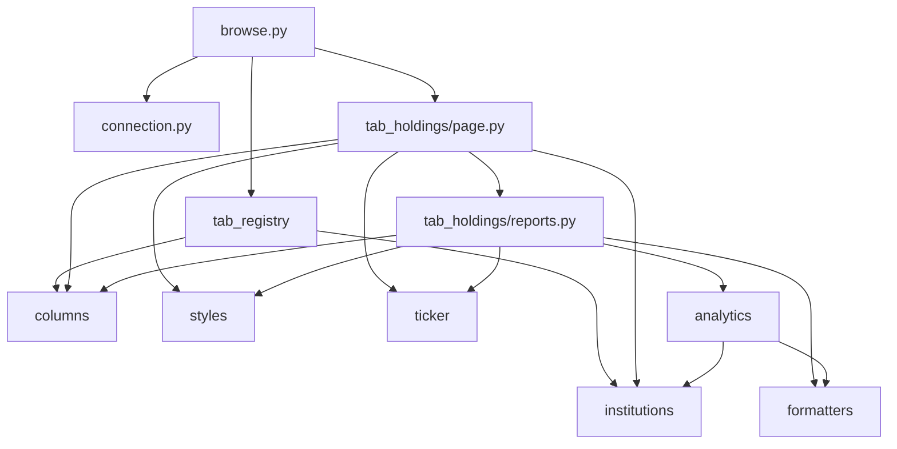

# GUI 程序结构说明

Streamlit 本地浏览 SQLite 中的 13F 数据。入口为 `browse.py`，业务按「基础设施 → 数据访问 → 计算 → 页面」分层，避免单文件堆叠 UI 与 SQL。

## 运行

```bash
uv run streamlit run thirteenf/gui/browse.py
```

侧栏可改 SQLite 路径（默认 `data/13f_history.sqlite`）。路径解析与连接缓存在 `connection.py`。

## 界面 Tab

| Tab | 模块 | 说明 |
|-----|------|------|
| 机构与报送 | `tab_registry.py` | `filer_registry`、按 CIK 筛选的 `ingest_record`；**不做**持仓聚合 |
| 报表分析 | `tab_holdings/` | 选机构 + **complete** 报送 → 分析报告 + 可筛选持仓表 |

「原始 JSON」Tab 已移除；告警等长字段如需查看请直接查库或后续单独加工具页。

## 目录与职责

```
thirteenf/gui/
├── browse.py              # 入口：页面配置、侧栏 DB、Tab 路由
├── connection.py          # resolve_db / connect / @st.cache_resource 连接
├── columns.py             # 列名中文化、KPI 帮助文案、dataframe 列对齐配置
├── formatters.py          # 金额紧凑显示、带符号 USD
├── periods.py             # 13F 日历年季度：report_date → Qx · 季初–季末
├── institutions.py        # 机构列表、报送列表、QoQ 股数、CUSIP 市值变动（纯 SQL/ pandas）
├── analytics.py           # KPI / Top10 新建仓 / 变动 Top / GICS 行业流（含 @st.cache_data）
├── ticker.py              # 从 cusip_ref 合并 Ticker 展示列
├── styles.py              # KPI 等高、边框面板、变动卡片等 CSS 注入
├── tab_registry.py        # Tab「机构与报送」渲染
└── tab_holdings/
    ├── __init__.py        # 导出 render(conn, db)
    ├── page.py            # Tab 布局：选择器 + 报告区 + 持仓表
    └── reports.py         # 分析子块：KPI、Top10、变动卡片、Altair 行业流
```

### 依赖关系（简图）



## 数据与口径

- **机构**：`filer_registry` + 仅在 `ingest_record` 出现过的「孤儿」CIK（`institutions.tab_a_institution_list`）。
- **报表分析 Tab**：仅 `status = 'complete'` 的报送；环比、净买卖、行业流均相对**同一机构**上一份 **complete**（`prior_complete_ingest_id`）。
- **申报市值**：`holding_line.value_as_reported` 为千美元，展示与 KPI 计算中 ×1000 为美元。
- **Ticker**：`cusip_ref.ticker`，需 `thirteenf-sync-cusip-refs`。
- **GICS 一级行业流**：`cusip_ref.gics_*`，需 `thirteenf-sync-gics-sectors`；OpenFIGI 不提供 GICS。

## 缓存

`analytics.py` 内 `@st.cache_data(ttl=30)` 的函数以 `(db_path, db_mtime, filer_cik, ingest_id, …)` 为键；数据库文件变更（`st_mtime`）会失效缓存。连接本身用 `@st.cache_resource`（`connection.cached_conn`）。

## 扩展指南

### 新增分析报告块（推荐）

1. 在 `analytics.py` 增加纯计算函数；若较重，加 `@st.cache_data` 包装。
2. 在 `tab_holdings/reports.py` 增加 `render_*`，负责文案、`st.metric` / 图表 / HTML。
3. 在 `tab_holdings/page.py` 的「分析报告」容器中插入 `st.divider()` 与 `render_*` 调用。
4. 新样式放入 `styles.py`，勿在 `reports.py` 内联大段 CSS。

### 新增 Tab

1. 新建 `tab_xxx.py` 或包 `tab_xxx/`，提供 `render(conn, …)`。
2. 在 `browse.py` 的 `st.tabs([...])` 中注册。

### 新增表头 / KPI 说明

- 中文列名：`columns.COL_ZH`
- KPI 悬停：`columns.KPI_HELP_*`

### 不宜放入 GUI 的逻辑

- SEC 抓取、XML 解析、OpenFIGI/Yahoo 同步 → 各自 CLI（`thirteenf-scrape`、`thirteenf-sync-*`）
- 复杂批处理或写库 → `thirteenf/` 包内非 `gui` 模块

## 相关命令（数据准备）

```bash
uv run thirteenf-scrape
uv run thirteenf-sync-cusip-refs --refresh-gaps
uv run thirteenf-sync-gics-sectors --force-all   # 首次或大量 GICS 空缺
```

更完整的运维说明见仓库根目录 `README.md`；证券标识与行业映射原理见 `docs/开发原理-证券标识与行业映射.md`。
